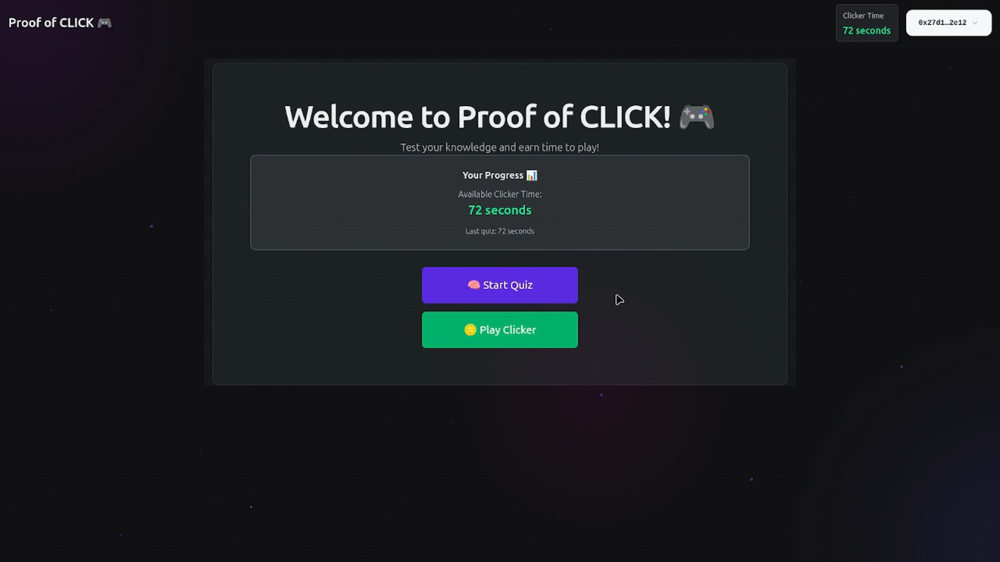
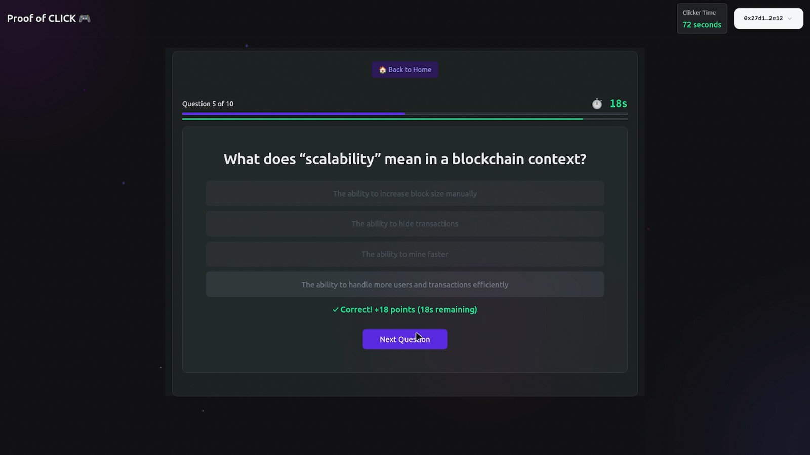
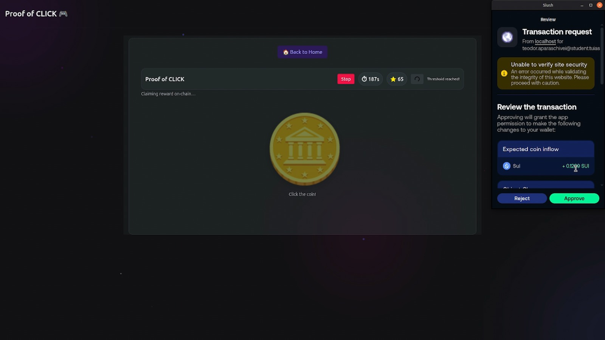

# Proof of CLICK 

Kahoot Style:
    10 minutes total time allocated per day
    1 question - 1 minute
    2 questions - 2 minutes
    Question response speed ~ time gained


Future improvements:
    - Player rankings
    - Monthly prizes
    - IPFS integration for question storage
    
Achievements:<br>
        2 quiz indeplinite - badge "Incepator"<br>
        5 quiz indeplinite - badge "Avansat"




A small Sui-based clicker + quiz dApp that demonstrates on-chain reward claims, an off-chain signer service, and a React frontend.

## Repository Structure

- `client/ — React + Vite frontend (TypeScript)
- `server/` — Python FastAPI signing server and `keygen.py`
- `on_chain/smart_contract/` — Move contract sources, build artifacts and tests

## Quickstart

Prerequisites:
- Node 18+ and `pnpm` for the frontend
- Python 3.10+ for the signing server
- Sui toolchain (optional, for publishing contracts)

1) Run the frontend

```bash
cd client
pnpm install
pnpm dev
```

2) Run the signing server (used for claim signatures)

```bash
cd server
python3 -m venv venv
source venv/bin/activate
pip install fastapi pynacl uvicorn python-dotenv pydantic

# generate keys (prints hex values for .env and the public key for the Move contract)
python keygen.py

# add the generated PRIVATE KEY to a .env file as ADMIN_SECRET_KEY
# e.g. ADMIN_SECRET_KEY=<hex-private-key>

uvicorn server:app --reload --port 5000
```

The server exposes `POST /claim` which expects JSON `{ "userAddress": "0x...", "points": <int> }` and returns a signature used by the Move contract.

## On-chain contract

The Move contract lives in `on_chain/smart_contract/sources/clicker.move` and contains:
- `GameBank` (shared vault)
- `deposit` to fund the vault
- `claim_reward` which verifies a signature from the admin public key and transfers SUI to the caller

Important: the admin public key in the Move source (`ADMIN_PUBLIC_KEY`) must match the public key produced by `keygen.py`.

Build artifacts are available in `on_chain/smart_contract/build/` after compilation.



## Notes about development

- Frontend: `client/src` contains the main UI including wallet integration and quiz logic.
- Server: `server/server.py` signs claim messages using the ADMIN secret key from `.env`.
- Contract: tests can be found in `on_chain/smart_contract/tests/`.

## Testing & Deployment

- Use Sui testnet or local validator to publish and test the Move package.
- When publishing, ensure the `ADMIN_PUBLIC_KEY` in the Move sources matches the server's generated public key.
